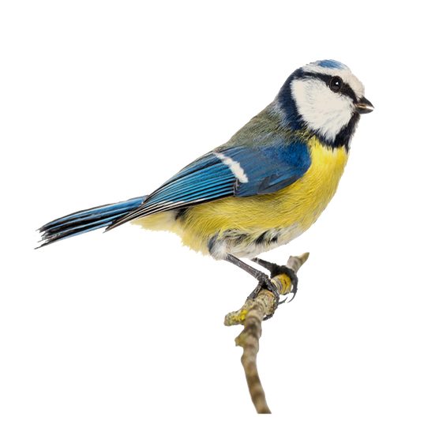

# Final Year Project

## Investigating Methods of Birdsong Recognition on Mobile Devices

### Intro
* This repository contains the files and source code that accompanies the report found [here](https://github.com/BurkeO/Dissertation). Specifically, the source code for audio preprocessing and machine learning.
* For the Android application, you will find it [here](https://github.com/BurkeO/Final_Year_Project_App).

#### This repository contains:
* [A set of audio files](Ambient-Sounds) for augmenting a dataset of birdsong recordings with different examples of background noise.
* [An example dataset](Consistent_dataset) of bird species and their birdsong.
* A set of [Google Colab Notebooks](Notebooks) for preprocessing the audio, evaluating certain methods and training a CNN that can be downloaded as a TensorflowLite file for the Android application.
* An [already trained CNN model](Seven_Species_Model/model.tflite) on a set of seven different bird species and the [relevant classes](Seven_Species_Model/labels.txt).
* The source code for an [audio-fingerprinting approach](Test_Dejavu/dejavu) [1].
* An examination of a possible [preprocessing method](Test_Repet) for isolating the birdsong from its environment.
* A set of tools that were used to:   
    * Generate an [evenly distributed](Tools/evenly_distribute) dataset.
    * [Gather a sub-dataset](Tools/gather_subdataset) of certain species from a larger collection.
    * [Add the necessary metadata](Tools/Model_Metadata_Maker) to a TensorflowLite file.
    * Convert a collection of [mp3 files to wav files](Tools/mp3_to_wav).
    * [Print](Tools/print_species) the species, number of species and distribution of species in a dataset. See the [species count file](species_count.txt).
    * [Gather a collection of recordings](Tools/recordings_gatherer) from the [Xeno-Canto](https://www.xeno-canto.org/) API.
    * [Split a dataset](Tools/split_to_train_and_validation) into a training and validation dataset for training the neural network.
    

#
[1] Drevo, W. (2020) Dejavu (Version e56a4a2) https://willdrevo.com/fingerprinting-and-audio-recognition-with-python/ [Source Code]. https://github.com/worldveil/dejavu.

